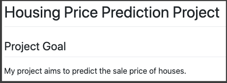
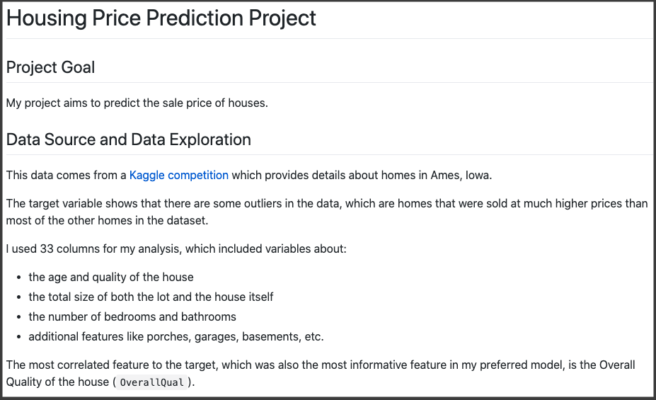
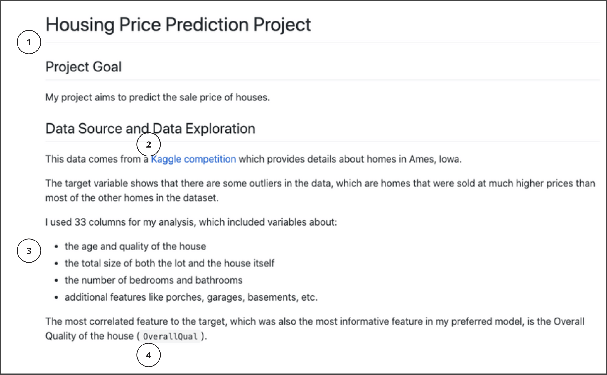

# Readability

So far you have gone from enhanced the ![repository image], then the content of the documents themselves[quick image], and now you examine how to best annotate the content itelf. 

To fully communicate the quality of your work it needs to be readable. What does readability mean? It means the most important information is highlighted and complex code is explained. Since your analysis is in a Jupyter notebook, you have the narrative of your analysis and important code all in the same place. You will use two different tools to enhance the readability of your notebook: markdown for the narrative and comments for the code. 

## Learning Goals:
- Use markdown to enhance the readability of text
- Use comments to enhance the readability of code

## Markdown

Markdown is a **plain text formatting syntax**, that allows you to format text quickly without needed to write in a text editor. Markdown allows you to quickly format plain text using special characters like asterisks, dashes, underscores, etc. Markdown enables you to create headers, lists, code blocks and more without lifting your fingers off your keyboard. 

For example, which chunk of text is more readable?

**Example A:**


**or**

**Example B:**


Example B! But what makes them different? The only difference between Examples A and B is that Example B adds __Markdown__ syntax to Example A. Here is what Example B looks like before it is rendered:

```
# Housing Price Prediction Project

## Project Goal

My project aims to predict the sale price of houses.
```

### Headings example

When you use text editing software like Microsoft Word or Google Docs, you use different level headings to create a consistent heirarchy of information in your documentation. H1 headings are the  highest level, like the title of the document, while H2 and H3 headings are lower in value. You denote a line is a heading by putting a hash mark next to the text, so the title in your analysis:


If you add one hash mark:

```
# Housing Price Prediction Project
```

The text becomes large and bold:



The title of your analysis should have the highest level of header and your section headings, such as "Business Question" or "Data Understanding" should have H2 headings, etc. 

### Practice

You can practice your understanding of markdown using the following exercise:

1) Examine the plaintext below:


2) Now examine the rendered text below and find **4 examples** of markdown being used to enhance the readability of the text:



3) Once you have identified four examples, look at the numbered image below to confirm your answers:



4) Review the numbered answers listed below to confirm what was updated:

    1. headings and subheadings, used to show the organization of the file 
    2. link embedding, used to create linked text so the full text of a URL does not need to be shown
    3. bulleted list, used to effectively convey lists
    4. code text, used to show that this is the name of a variable

Try updating the text in our messy repo to match the updated formatting.

### Further Markdown Resources:

 - [GitHub's Markdown Cheat Sheet](https://guides.github.com/pdfs/markdown-cheatsheet-online.pdf)
 - [Document design free ebook](https://pressbooks.bccampus.ca/technicalwriting/)
 
## Code Comments
 
The [Zen of Python](https://www.python.org/dev/peps/pep-0020/) states that "Readability counts". You covered how to make text more readable, but what about code? Enter code comments and docstrings.
 
### Comments

Code comments can show up three main ways:

#### 1) at the top, before code, to say what it will do

```
# Prints the zen of python
print(this)
```

#### 2) on the side, explaining what the code does
```
print(this) # prints the zen of python
```

#### 3) in the midst of code, telling Python to ignore that section of code and to not run it

```
# print(this)
print("something else")
```

### Comments Example

[Lindsey, I want an example like this, but using our code]   [MIT example](https://ocw.mit.edu/courses/electrical-engineering-and-computer-science/6-189-a-gentle-introduction-to-programming-using-python-january-iap-2011/lectures/MIT6_189IAP11_comment.pdf)


### Docstrings

Docstrings are multi-line comments that usually explain what a _function_, _class_, or _module_ is intended to do. Whenever you type `shift+tab` in a code cell and get the documentation? The documentation is populated by docstrings writen in the code itself. Examine [the source code for the Pandas groupby object](https://github.com/pandas-dev/pandas/blob/master/pandas/core/groupby/groupby.py#L1168) to see docstrings in action. 


```
"""
docstrings are the text in triple quotes

that can take multiple lines and still not interfere
  
  
  
with the code
"""

```

Docstrings help future employers AND our future selves to understand our code at a later date. It not only makes code more readable, but makes it more _usable_ in the future.
 
### Docstrings Example

If you wanted to make the below Example Function more readable, you could use BOTH comments and docstrings.

#### Example Function:
 
```python
def summarize_dataframe(df):
    summary = pd.DataFrame(df.dtypes,columns=['dtypes'])
    summary = summary.reset_index()
    summary['Name'] = summary['index']
    summary = summary[['Name','dtypes']]
    summary['Missing'] = df.isnull().sum().values    
    summary['Uniques'] = df.nunique().values
    return summary
```

#### Example Function with comments and docstrings:

```python
def summarize_dataframe(df):
    '''
    Summarizes each column in a Pandas dataframe, where each row of the 
    summary output is a column of the input dataframe, df
    Will show the datatype of data in the column, the number of missing values
    in that column, and the number of unique values in the column
    -
    Input:
    df : Pandas dataframe
    -
    Output:
    summary : Pandas dataframe, now showing column details
    '''
    summary = pd.DataFrame(df.dtypes,columns=['dtypes'])
    summary = summary.reset_index()
    summary['Name'] = summary['index'] # name of each variable 
    summary = summary[['Name','dtypes']] # data type of each variable
    summary['Missing'] = df.isnull().sum().values # number of missing values  
    summary['Uniques'] = df.nunique().values # number of unique values
    return summary
```

### Further reading on creating readable code:

- Ultimate guide for readable code: [Pep8 standards](https://www.python.org/dev/peps/pep-0008/)
- If you want more information on docstring expectations look [here](https://www.python.org/dev/peps/pep-0257/)
 